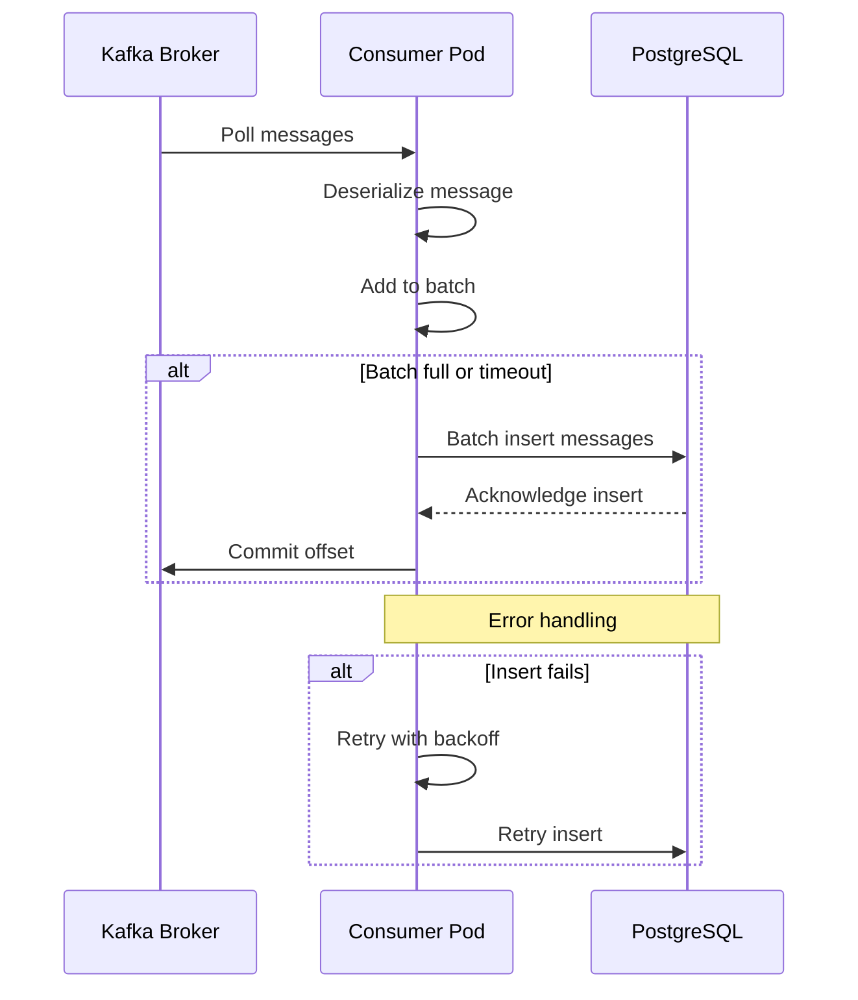

# Detailed Implementation Plan - Kafka to PostgreSQL Consumer

## Project Structure

```
kafka-postgres-consumer/
├── postgres-setup/
│   ├── install-postgres.sh          # PostgreSQL installation script
│   ├── init-database.sql            # Database and schema creation
│   └── configure-postgres.sh        # Configuration for remote access
├── consumer-app/
│   ├── consumer.py                  # Main Kafka consumer application
│   ├── requirements.txt             # Python dependencies
│   └── Dockerfile                   # Container image definition
├── kubernetes/
│   ├── configmap.yaml              # Configuration data
│   ├── secret.yaml                 # Sensitive credentials
│   └── deployment.yaml             # Consumer deployment
├── tests/
│   ├── test-postgres-connection.py # PostgreSQL connectivity test
│   └── test-kafka-connection.py    # Kafka connectivity test
└── docs/
    ├── SETUP_GUIDE.md              # Step-by-step setup instructions
    └── TROUBLESHOOTING.md          # Common issues and solutions
```

## Detailed Component Breakdown

### 1. PostgreSQL Setup Scripts

#### install-postgres.sh
- Detects Linux distribution (Ubuntu/Debian, RHEL/CentOS, etc.)
- Installs PostgreSQL 15
- Starts and enables PostgreSQL service
- Creates initial admin user

#### init-database.sql
- Creates `turbonomic_data` database
- Creates `manfred` user with password
- Grants necessary permissions
- Creates `kafka_messages` table with schema:
  - id (BIGSERIAL PRIMARY KEY)
  - message_key (TEXT)
  - message_value (JSONB)
  - topic (VARCHAR)
  - partition (INTEGER)
  - offset (BIGINT)
  - timestamp (TIMESTAMP)
  - consumed_at (TIMESTAMP)
  - created_at (TIMESTAMP DEFAULT NOW())
- Creates indexes for efficient querying

#### configure-postgres.sh
- Modifies `postgresql.conf` for remote connections
- Updates `pg_hba.conf` for authentication
- Configures firewall (firewalld or ufw)
- Restarts PostgreSQL service

### 2. Consumer Application

#### consumer.py
**Key Features:**
- Kafka consumer using `kafka-python` library
- PostgreSQL connection using `psycopg2` with connection pooling
- Batch processing for efficiency
- Error handling with exponential backoff
- Graceful shutdown on SIGTERM/SIGINT
- Health check endpoint (optional)
- Structured logging

**Main Functions:**
- `connect_postgres()`: Establishes database connection pool
- `connect_kafka()`: Creates Kafka consumer instance
- `process_message()`: Processes individual message
- `batch_insert()`: Inserts messages in batches
- `main()`: Main event loop

#### requirements.txt
```
kafka-python==2.0.2
psycopg2-binary==2.9.9
python-json-logger==2.0.7
```

#### Dockerfile
- Base image: python:3.11-slim
- Multi-stage build for smaller image size
- Non-root user for security
- Health check configuration
- Proper signal handling

### 3. Kubernetes Resources

#### configmap.yaml
**Configuration Data:**
- Kafka bootstrap servers
- Kafka topic name
- Consumer group ID
- PostgreSQL host
- PostgreSQL port
- Database name
- Batch size
- Commit interval
- Log level

#### secret.yaml
**Sensitive Data:**
- PostgreSQL username (base64 encoded)
- PostgreSQL password (base64 encoded)

#### deployment.yaml
**Deployment Specifications:**
- 1 replica (can be scaled)
- Resource requests: 256Mi memory, 250m CPU
- Resource limits: 512Mi memory, 500m CPU
- Environment variables from ConfigMap and Secret
- Liveness and readiness probes
- Graceful termination period

### 4. Testing Scripts

#### test-postgres-connection.py
- Tests connection to PostgreSQL server
- Verifies database exists
- Checks table structure
- Performs sample insert and query
- Reports connection latency

#### test-kafka-connection.py
- Tests connection to Kafka broker
- Lists available topics
- Verifies `turbonomic.exporter` topic exists
- Checks consumer group status

## Implementation Workflow

### Phase 1: PostgreSQL Setup (30 minutes)
1. SSH to Linux box (192.168.178.61)
2. Run `install-postgres.sh`
3. Run `init-database.sql`
4. Run `configure-postgres.sh`
5. Verify installation with test script

### Phase 2: Application Development (45 minutes)
1. Create consumer application
2. Implement error handling
3. Add logging
4. Test locally (if possible)

### Phase 3: Containerization (20 minutes)
1. Create Dockerfile
2. Build Docker image
3. Test container locally
4. Push to registry (optional)

### Phase 4: Kubernetes Deployment (30 minutes)
1. Create ConfigMap
2. Create Secret
3. Create Deployment
4. Apply manifests
5. Verify pod status

### Phase 5: Testing and Validation (30 minutes)
1. Check pod logs
2. Verify Kafka consumption
3. Query PostgreSQL for messages
4. Monitor for errors
5. Performance testing

## Data Flow Diagram



## Error Handling Strategy

### Kafka Consumer Errors
- Connection failures: Retry with exponential backoff
- Deserialization errors: Log and skip message
- Offset commit failures: Retry commit

### PostgreSQL Errors
- Connection failures: Reconnect with backoff
- Insert failures: Retry with backoff
- Constraint violations: Log and continue
- Deadlocks: Retry transaction

### Application Errors
- Out of memory: Reduce batch size
- Timeout errors: Increase timeout values
- Signal handling: Graceful shutdown

## Performance Considerations

### Batch Processing
- Default batch size: 100 messages
- Configurable via environment variable
- Trade-off between latency and throughput

### Connection Pooling
- PostgreSQL connection pool: 5-10 connections
- Reuse connections for efficiency
- Handle connection timeouts

### Resource Limits
- Memory: 512Mi limit (256Mi request)
- CPU: 500m limit (250m request)
- Adjust based on message volume

## Monitoring and Observability

### Metrics to Track
- Messages consumed per second
- Messages inserted per second
- Database connection pool usage
- Error rate
- Lag in Kafka consumer group

### Logging
- Structured JSON logging
- Log levels: DEBUG, INFO, WARNING, ERROR
- Include correlation IDs
- Log message metadata

### Health Checks
- Liveness probe: Application responsive
- Readiness probe: Can process messages
- Startup probe: Initial connection established

## Security Best Practices

1. **Credentials Management**
   - Use Kubernetes Secrets
   - Never commit passwords to Git
   - Rotate credentials regularly

2. **Network Security**
   - Restrict PostgreSQL access by IP
   - Use firewall rules
   - Consider SSL/TLS for database connections

3. **Container Security**
   - Run as non-root user
   - Minimal base image
   - Regular security updates

4. **Access Control**
   - Principle of least privilege
   - Database user has only necessary permissions
   - RBAC for Kubernetes resources

## Maintenance and Operations

### Regular Tasks
- Monitor disk space on PostgreSQL server
- Review and archive old messages
- Update dependencies
- Review logs for errors

### Backup Strategy
- Regular PostgreSQL backups
- Test restore procedures
- Document backup locations

### Scaling Considerations
- Horizontal scaling: Increase replicas
- Partition assignment: Kafka handles automatically
- Database performance: Add indexes as needed

## Success Criteria

The implementation will be considered successful when:
1. PostgreSQL is installed and accessible from Kubernetes cluster
2. Consumer pod is running without errors
3. Messages are being consumed from Kafka
4. Messages are being stored in PostgreSQL
5. No data loss occurs
6. Performance meets requirements (latency < 1s per batch)
7. Error handling works correctly
8. Monitoring and logging are functional

## Next Steps

After reviewing this detailed plan:
1. Confirm the approach meets your requirements
2. Proceed with creating all scripts and configurations
3. Provide step-by-step execution instructions
4. Include troubleshooting guide