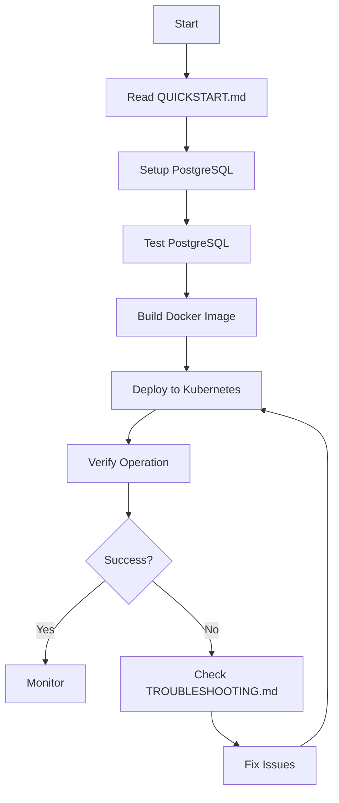

# Project Index - Kafka to PostgreSQL Consumer

Complete index of all project files and their purposes.

## 📋 Quick Navigation

- **Getting Started**: [QUICKSTART.md](QUICKSTART.md) - 15-minute setup guide
- **Main Documentation**: [README.md](README.md) - Project overview
- **Detailed Setup**: [docs/SETUP_GUIDE.md](docs/SETUP_GUIDE.md) - Step-by-step instructions
- **Troubleshooting**: [docs/TROUBLESHOOTING.md](docs/TROUBLESHOOTING.md) - Problem resolution
- **Deployment**: [DEPLOYMENT_CHECKLIST.md](DEPLOYMENT_CHECKLIST.md) - Pre-flight checklist

## 📁 Project Structure

```
kafka-postgres-consumer/
├── 📄 README.md                          # Main project documentation
├── 📄 QUICKSTART.md                      # 15-minute quick start guide
├── 📄 DEPLOYMENT_CHECKLIST.md            # Deployment verification checklist
├── 📄 SETUP_PLAN.md                      # High-level implementation plan
├── 📄 DETAILED_IMPLEMENTATION_PLAN.md    # Detailed implementation guide
├── 📄 TECHNICAL_SPECIFICATIONS.md        # Technical architecture and specs
├── 📄 PROJECT_INDEX.md                   # This file
├── 📄 .gitignore                         # Git ignore patterns
│
├── 📁 postgres-setup/                    # PostgreSQL installation scripts
│   ├── 🔧 install-postgres.sh           # PostgreSQL 15 installation
│   ├── 📊 init-database.sql             # Database and schema creation
│   └── 🔧 configure-postgres.sh         # Remote access configuration
│
├── 📁 consumer-app/                      # Consumer application
│   ├── 🐍 consumer.py                   # Main consumer application (372 lines)
│   ├── 📦 requirements.txt              # Python dependencies
│   └── 🐳 Dockerfile                    # Container image definition
│
├── 📁 kubernetes/                        # Kubernetes manifests
│   ├── ⚙️  configmap.yaml               # Application configuration
│   ├── 🔐 secret.yaml                   # Database credentials
│   └── 🚀 deployment.yaml               # Deployment specification
│
├── 📁 tests/                            # Testing scripts
│   ├── 🧪 test-postgres-connection.py   # PostgreSQL connectivity test
│   └── 🧪 test-kafka-connection.py      # Kafka connectivity test
│
└── 📁 docs/                             # Documentation
    ├── 📖 SETUP_GUIDE.md                # Complete setup guide (545 lines)
    └── 🔍 TROUBLESHOOTING.md            # Troubleshooting guide (673 lines)
```

## 📚 Documentation Files

### Core Documentation

| File | Purpose | Lines | Audience |
|------|---------|-------|----------|
| [README.md](README.md) | Project overview, features, quick reference | 449 | Everyone |
| [QUICKSTART.md](QUICKSTART.md) | Fast 15-minute setup guide | 175 | New users |
| [DEPLOYMENT_CHECKLIST.md](DEPLOYMENT_CHECKLIST.md) | Pre-deployment verification | 346 | Operators |

### Planning Documents

| File | Purpose | Lines | Audience |
|------|---------|-------|----------|
| [SETUP_PLAN.md](SETUP_PLAN.md) | High-level architecture and plan | 145 | Architects |
| [DETAILED_IMPLEMENTATION_PLAN.md](DETAILED_IMPLEMENTATION_PLAN.md) | Detailed implementation workflow | 329 | Developers |
| [TECHNICAL_SPECIFICATIONS.md](TECHNICAL_SPECIFICATIONS.md) | Technical specs and design | 391 | Engineers |

### Detailed Guides

| File | Purpose | Lines | Audience |
|------|---------|-------|----------|
| [docs/SETUP_GUIDE.md](docs/SETUP_GUIDE.md) | Step-by-step setup instructions | 545 | Operators |
| [docs/TROUBLESHOOTING.md](docs/TROUBLESHOOTING.md) | Problem diagnosis and resolution | 673 | Support |

## 🔧 Implementation Files

### PostgreSQL Setup (postgres-setup/)

| File | Purpose | Lines | Usage |
|------|---------|-------|-------|
| `install-postgres.sh` | Installs PostgreSQL 15 | 143 | `sudo ./install-postgres.sh` |
| `init-database.sql` | Creates database and schema | 169 | `sudo -u postgres psql -f init-database.sql` |
| `configure-postgres.sh` | Enables remote connections | 184 | `sudo ./configure-postgres.sh` |

**Total**: 496 lines of setup automation

### Consumer Application (consumer-app/)

| File | Purpose | Lines | Usage |
|------|---------|-------|-------|
| `consumer.py` | Main Kafka consumer | 372 | Runs in container |
| `requirements.txt` | Python dependencies | 7 | `pip install -r requirements.txt` |
| `Dockerfile` | Container image | 54 | `docker build -t kafka-postgres-consumer .` |

**Total**: 433 lines of application code

### Kubernetes Resources (kubernetes/)

| File | Purpose | Lines | Usage |
|------|---------|-------|-------|
| `configmap.yaml` | Application configuration | 31 | `kubectl apply -f configmap.yaml` |
| `secret.yaml` | Database credentials | 23 | `kubectl apply -f secret.yaml` |
| `deployment.yaml` | Deployment specification | 105 | `kubectl apply -f deployment.yaml` |

**Total**: 159 lines of Kubernetes manifests

### Testing Scripts (tests/)

| File | Purpose | Lines | Usage |
|------|---------|-------|-------|
| `test-postgres-connection.py` | PostgreSQL connectivity test | 318 | `python test-postgres-connection.py` |
| `test-kafka-connection.py` | Kafka connectivity test | 268 | `python test-kafka-connection.py` |

**Total**: 586 lines of testing code

## 📊 Project Statistics

- **Total Files**: 19
- **Total Lines of Code**: ~4,000+
- **Documentation**: ~2,700 lines
- **Implementation**: ~1,300 lines
- **Languages**: Python, SQL, Bash, YAML
- **Containers**: 1 (consumer application)
- **Kubernetes Resources**: 3 (ConfigMap, Secret, Deployment)

## 🎯 Usage by Role

### For First-Time Users
1. Start with [QUICKSTART.md](QUICKSTART.md)
2. Follow [docs/SETUP_GUIDE.md](docs/SETUP_GUIDE.md) for details
3. Use [DEPLOYMENT_CHECKLIST.md](DEPLOYMENT_CHECKLIST.md) to verify

### For Developers
1. Review [TECHNICAL_SPECIFICATIONS.md](TECHNICAL_SPECIFICATIONS.md)
2. Study [consumer-app/consumer.py](consumer-app/consumer.py)
3. Check [DETAILED_IMPLEMENTATION_PLAN.md](DETAILED_IMPLEMENTATION_PLAN.md)

### For Operators
1. Use [DEPLOYMENT_CHECKLIST.md](DEPLOYMENT_CHECKLIST.md)
2. Keep [docs/TROUBLESHOOTING.md](docs/TROUBLESHOOTING.md) handy
3. Reference [docs/SETUP_GUIDE.md](docs/SETUP_GUIDE.md) for procedures

### For Architects
1. Read [SETUP_PLAN.md](SETUP_PLAN.md)
2. Review [TECHNICAL_SPECIFICATIONS.md](TECHNICAL_SPECIFICATIONS.md)
3. Study [DETAILED_IMPLEMENTATION_PLAN.md](DETAILED_IMPLEMENTATION_PLAN.md)

## 🔍 Finding Information

### Setup and Installation
- **PostgreSQL Setup**: [postgres-setup/](postgres-setup/) directory
- **Consumer Setup**: [consumer-app/](consumer-app/) directory
- **Kubernetes Setup**: [kubernetes/](kubernetes/) directory
- **Complete Guide**: [docs/SETUP_GUIDE.md](docs/SETUP_GUIDE.md)

### Configuration
- **Application Config**: [kubernetes/configmap.yaml](kubernetes/configmap.yaml)
- **Credentials**: [kubernetes/secret.yaml](kubernetes/secret.yaml)
- **Environment Variables**: [TECHNICAL_SPECIFICATIONS.md](TECHNICAL_SPECIFICATIONS.md#configuration-parameters)

### Troubleshooting
- **Quick Fixes**: [QUICKSTART.md](QUICKSTART.md#troubleshooting-quick-fixes)
- **Detailed Guide**: [docs/TROUBLESHOOTING.md](docs/TROUBLESHOOTING.md)
- **Common Issues**: [docs/TROUBLESHOOTING.md](docs/TROUBLESHOOTING.md#common-issues)

### Testing
- **PostgreSQL Test**: [tests/test-postgres-connection.py](tests/test-postgres-connection.py)
- **Kafka Test**: [tests/test-kafka-connection.py](tests/test-kafka-connection.py)
- **Testing Guide**: [docs/SETUP_GUIDE.md](docs/SETUP_GUIDE.md#testing)

### Architecture
- **Overview**: [README.md](README.md#architecture)
- **Technical Details**: [TECHNICAL_SPECIFICATIONS.md](TECHNICAL_SPECIFICATIONS.md)
- **Data Flow**: [DETAILED_IMPLEMENTATION_PLAN.md](DETAILED_IMPLEMENTATION_PLAN.md#data-flow-diagram)

## 🚀 Deployment Workflow



## 📝 File Modification Guide

### When to Update Each File

| File | Update When |
|------|-------------|
| `configmap.yaml` | Changing configuration (batch size, timeouts, etc.) |
| `secret.yaml` | Changing credentials |
| `deployment.yaml` | Changing resources, replicas, or image |
| `consumer.py` | Modifying consumer logic |
| `Dockerfile` | Changing dependencies or base image |
| `requirements.txt` | Adding/updating Python packages |
| `*.sh` scripts | Modifying PostgreSQL setup |
| `init-database.sql` | Changing database schema |
| Documentation | Any changes to procedures or architecture |

## 🔐 Security Notes

### Sensitive Files
- `kubernetes/secret.yaml` - Contains base64-encoded credentials
- `postgres-setup/init-database.sql` - Contains password in plain text

### Best Practices
1. Never commit actual credentials to Git
2. Use Kubernetes Secrets for production
3. Rotate credentials regularly
4. Restrict access to PostgreSQL server
5. Use SSL/TLS for database connections (optional)

## 📞 Support Resources

### Documentation
- **Setup Issues**: [docs/SETUP_GUIDE.md](docs/SETUP_GUIDE.md)
- **Runtime Issues**: [docs/TROUBLESHOOTING.md](docs/TROUBLESHOOTING.md)
- **Architecture Questions**: [TECHNICAL_SPECIFICATIONS.md](TECHNICAL_SPECIFICATIONS.md)

### Commands
```bash
# View logs
kubectl logs -f $POD_NAME -n turbonomic

# Check status
kubectl get pods -n turbonomic -l app=kafka-postgres-consumer

# Test connections
python tests/test-postgres-connection.py
python tests/test-kafka-connection.py
```

## ✅ Verification

After setup, verify:
- [ ] All files present and readable
- [ ] Scripts are executable (`chmod +x *.sh`)
- [ ] Configuration values are correct
- [ ] Documentation is accessible
- [ ] Tests can be run

## 🎓 Learning Path

1. **Beginner**: Start with [README.md](README.md) and [QUICKSTART.md](QUICKSTART.md)
2. **Intermediate**: Read [docs/SETUP_GUIDE.md](docs/SETUP_GUIDE.md) and [TECHNICAL_SPECIFICATIONS.md](TECHNICAL_SPECIFICATIONS.md)
3. **Advanced**: Study [consumer.py](consumer-app/consumer.py) and [DETAILED_IMPLEMENTATION_PLAN.md](DETAILED_IMPLEMENTATION_PLAN.md)

---

**Last Updated**: 2026-02-23  
**Version**: 1.0.0  
**Status**: Production Ready ✅