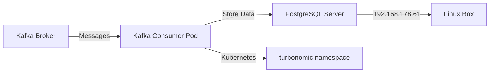

# Kafka Consumer to PostgreSQL - Complete Setup Plan

## Overview
This plan covers the complete setup of a Kafka consumer that reads messages from the `turbonomic.exporter` topic and stores them in a PostgreSQL database running on a separate Linux box.

## Architecture

## Configuration Details

- **PostgreSQL Server**: 192.168.178.61
- **Database Name**: turbonomic_data
- **Database User**: manfred
- **Database Password**: Test7283
- **Kafka Topic**: turbonomic.exporter
- **Kafka Bootstrap Server**: kafka:9092
- **Kubernetes Namespace**: turbonomic

## Components to Create

### 1. PostgreSQL Setup (on Linux Box 192.168.178.61)
- Installation script for PostgreSQL
- Database initialization script
- User and permissions setup
- Network configuration for remote access
- Firewall configuration

### 2. Database Schema
- Table structure for storing Kafka messages
- Indexes for efficient querying
- Timestamp tracking
- Message metadata storage

### 3. Kafka Consumer Application
- Python application using kafka-python and psycopg2
- Connection pooling for PostgreSQL
- Error handling and retry logic
- Logging and monitoring
- Graceful shutdown handling

### 4. Docker Container
- Dockerfile with all dependencies
- Multi-stage build for optimization
- Health check configuration

### 5. Kubernetes Resources
- Deployment manifest
- ConfigMap for configuration
- Secret for sensitive data
- Service (if needed)
- Resource limits and requests

### 6. Testing and Verification
- Connection test scripts
- Message flow verification
- Performance testing guidelines

## Implementation Steps

1. **PostgreSQL Installation** (on 192.168.178.61)
   - Install PostgreSQL 15
   - Configure for remote connections
   - Create database and user
   - Set up firewall rules

2. **Database Schema Creation**
   - Create tables for message storage
   - Set up indexes
   - Configure retention policies

3. **Consumer Application Development**
   - Implement Kafka consumer logic
   - Implement PostgreSQL writer
   - Add error handling
   - Add logging

4. **Containerization**
   - Build Docker image
   - Test locally
   - Push to registry (if needed)

5. **Kubernetes Deployment**
   - Create ConfigMap and Secret
   - Deploy consumer pod
   - Verify connectivity

6. **Testing and Validation**
   - Test message consumption
   - Verify database writes
   - Monitor for errors

## Message Storage Schema

The consumer will store messages with the following structure:
- **id**: Auto-incrementing primary key
- **message_key**: Kafka message key
- **message_value**: Kafka message value (JSON)
- **topic**: Source topic name
- **partition**: Kafka partition number
- **offset**: Kafka offset
- **timestamp**: Message timestamp
- **consumed_at**: When the message was consumed
- **created_at**: Database record creation time

## Security Considerations

- Database credentials stored in Kubernetes Secret
- PostgreSQL configured with password authentication
- Network access restricted by firewall
- SSL/TLS connection optional but recommended

## Monitoring and Maintenance

- Consumer logs available via kubectl logs
- Database connection monitoring
- Message processing rate tracking
- Error rate monitoring
- Disk space monitoring on PostgreSQL server

## Rollback Plan

If issues occur:
1. Scale down consumer deployment to 0 replicas
2. Investigate logs and database state
3. Fix issues in configuration or code
4. Redeploy with corrections
5. Verify functionality before scaling up

## Next Steps

After reviewing this plan, we will:
1. Create all necessary scripts and configurations
2. Provide step-by-step setup instructions
3. Include testing procedures
4. Document troubleshooting steps