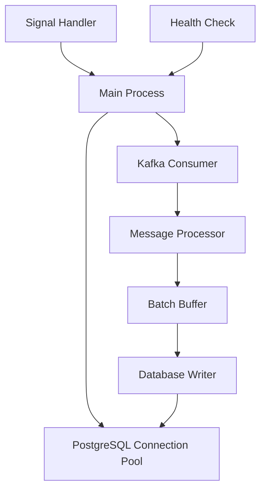
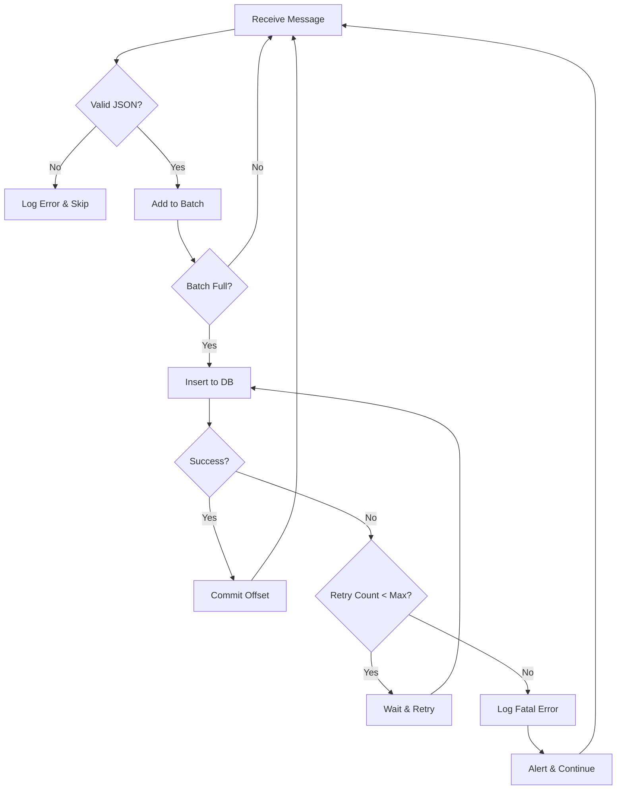

# Technical Specifications - Kafka to PostgreSQL Consumer

## System Requirements

### PostgreSQL Server (192.168.178.61)
- **OS**: Linux (Ubuntu 20.04+, RHEL 8+, or compatible)
- **RAM**: Minimum 2GB, Recommended 4GB+
- **Disk**: Minimum 20GB free space
- **Network**: Accessible from Kubernetes cluster
- **Ports**: 5432 (PostgreSQL)

### Kubernetes Cluster
- **Version**: 1.20+
- **Namespace**: turbonomic
- **Network**: Must reach 192.168.178.61:5432
- **Resources**: 512Mi memory, 500m CPU per pod

### Kafka Cluster
- **Bootstrap Server**: kafka:9092
- **Topic**: turbonomic.exporter
- **Version**: Compatible with kafka-python 2.0.2

## Database Schema Design

### Table: kafka_messages

```sql
CREATE TABLE kafka_messages (
    id BIGSERIAL PRIMARY KEY,
    message_key TEXT,
    message_value JSONB NOT NULL,
    topic VARCHAR(255) NOT NULL,
    partition INTEGER NOT NULL,
    offset BIGINT NOT NULL,
    timestamp TIMESTAMP WITH TIME ZONE,
    consumed_at TIMESTAMP WITH TIME ZONE NOT NULL,
    created_at TIMESTAMP WITH TIME ZONE DEFAULT CURRENT_TIMESTAMP,
    CONSTRAINT unique_message UNIQUE (topic, partition, offset)
);

-- Indexes for efficient querying
CREATE INDEX idx_kafka_messages_topic ON kafka_messages(topic);
CREATE INDEX idx_kafka_messages_timestamp ON kafka_messages(timestamp);
CREATE INDEX idx_kafka_messages_consumed_at ON kafka_messages(consumed_at);
CREATE INDEX idx_kafka_messages_value ON kafka_messages USING GIN (message_value);
```

### Table Columns Explained

| Column | Type | Description |
|--------|------|-------------|
| id | BIGSERIAL | Auto-incrementing primary key |
| message_key | TEXT | Kafka message key (nullable) |
| message_value | JSONB | Message payload stored as JSON |
| topic | VARCHAR(255) | Source Kafka topic |
| partition | INTEGER | Kafka partition number |
| offset | BIGINT | Kafka message offset |
| timestamp | TIMESTAMP | Original message timestamp |
| consumed_at | TIMESTAMP | When consumer processed the message |
| created_at | TIMESTAMP | Database record creation time |

### Unique Constraint
- Prevents duplicate messages based on (topic, partition, offset)
- Handles reprocessing scenarios gracefully

## Application Architecture

### Consumer Application Components



### Configuration Parameters

#### Kafka Configuration
```python
KAFKA_CONFIG = {
    'bootstrap_servers': 'kafka:9092',
    'group_id': 'turbonomic-postgres-consumer',
    'auto_offset_reset': 'earliest',
    'enable_auto_commit': False,
    'max_poll_records': 500,
    'session_timeout_ms': 30000,
    'heartbeat_interval_ms': 10000,
    'value_deserializer': lambda m: json.loads(m.decode('utf-8'))
}
```

#### PostgreSQL Configuration
```python
POSTGRES_CONFIG = {
    'host': '192.168.178.61',
    'port': 5432,
    'database': 'turbonomic_data',
    'user': 'manfred',
    'password': 'Test7283',
    'minconn': 1,
    'maxconn': 10,
    'connect_timeout': 10
}
```

#### Application Configuration
```python
APP_CONFIG = {
    'batch_size': 100,
    'batch_timeout': 5,  # seconds
    'max_retries': 3,
    'retry_backoff': 2,  # exponential backoff multiplier
    'log_level': 'INFO'
}
```

## Message Processing Flow

### Normal Flow
1. Consumer polls Kafka for messages
2. Messages added to in-memory batch buffer
3. When batch is full or timeout reached:
   - Begin database transaction
   - Insert all messages in batch
   - Commit transaction
   - Commit Kafka offsets
4. Repeat

### Error Handling Flow



## Performance Specifications

### Throughput Targets
- **Messages per second**: 100-1000 (depends on message size)
- **Batch processing**: 100 messages per batch
- **Database insert latency**: < 100ms per batch
- **End-to-end latency**: < 1 second

### Resource Usage
- **Memory**: 256Mi baseline, 512Mi limit
- **CPU**: 250m baseline, 500m limit
- **Network**: ~1-10 Mbps (depends on message size)
- **Disk I/O**: Handled by PostgreSQL server

### Scalability
- **Horizontal scaling**: Add more consumer replicas
- **Kafka partitions**: Automatically distributed
- **Database connections**: Pooled and reused
- **Maximum replicas**: Limited by Kafka partitions

## Security Specifications

### Authentication
- **PostgreSQL**: Password authentication (md5 or scram-sha-256)
- **Kafka**: No authentication (internal cluster)
- **Kubernetes**: RBAC for pod access

### Network Security
```
Firewall Rules (on 192.168.178.61):
- Allow TCP 5432 from Kubernetes pod network
- Deny all other incoming connections
```

### Data Security
- **In-transit**: Optional SSL/TLS for PostgreSQL
- **At-rest**: PostgreSQL encryption (optional)
- **Credentials**: Stored in Kubernetes Secrets
- **Audit**: PostgreSQL audit logging (optional)

## Monitoring Specifications

### Application Metrics
- Messages consumed (counter)
- Messages inserted (counter)
- Processing errors (counter)
- Batch processing time (histogram)
- Database connection pool usage (gauge)
- Kafka consumer lag (gauge)

### Health Checks
```yaml
livenessProbe:
  httpGet:
    path: /health
    port: 8080
  initialDelaySeconds: 30
  periodSeconds: 10
  
readinessProbe:
  httpGet:
    path: /ready
    port: 8080
  initialDelaySeconds: 10
  periodSeconds: 5
```

### Logging Format
```json
{
  "timestamp": "2026-02-23T10:39:00Z",
  "level": "INFO",
  "message": "Batch inserted successfully",
  "batch_size": 100,
  "duration_ms": 85,
  "topic": "turbonomic.exporter",
  "consumer_group": "turbonomic-postgres-consumer"
}
```

## Disaster Recovery

### Backup Strategy
- **PostgreSQL backups**: Daily full backup
- **Retention**: 7 days minimum
- **Backup location**: Separate storage system
- **Recovery time objective (RTO)**: < 1 hour
- **Recovery point objective (RPO)**: < 24 hours

### Failure Scenarios

#### Scenario 1: Consumer Pod Crash
- **Detection**: Kubernetes liveness probe fails
- **Action**: Automatic pod restart
- **Impact**: Minimal, Kafka retains messages
- **Recovery time**: < 1 minute

#### Scenario 2: PostgreSQL Connection Loss
- **Detection**: Connection error in application
- **Action**: Retry with exponential backoff
- **Impact**: Messages buffered in Kafka
- **Recovery time**: Automatic when DB recovers

#### Scenario 3: Kafka Broker Down
- **Detection**: Consumer poll timeout
- **Action**: Wait and retry connection
- **Impact**: No message consumption
- **Recovery time**: Automatic when Kafka recovers

#### Scenario 4: Database Full
- **Detection**: Insert error (disk full)
- **Action**: Alert and stop consuming
- **Impact**: Consumer lag increases
- **Recovery time**: Manual intervention required

## Compliance and Audit

### Data Retention
- **Default**: Indefinite retention
- **Optional**: Implement time-based partitioning
- **Archival**: Move old data to archive tables
- **Deletion**: Implement retention policy as needed

### Audit Trail
- All messages include `consumed_at` timestamp
- Database logs all connections and queries (optional)
- Application logs all processing events
- Kubernetes logs pod lifecycle events

## Testing Specifications

### Unit Tests
- Message deserialization
- Batch buffer management
- Database connection handling
- Error handling logic

### Integration Tests
- Kafka to consumer connectivity
- Consumer to PostgreSQL connectivity
- End-to-end message flow
- Error recovery scenarios

### Performance Tests
- Throughput under load
- Latency measurements
- Resource usage monitoring
- Scalability testing

### Acceptance Criteria
1. ✓ Consumer connects to Kafka successfully
2. ✓ Consumer connects to PostgreSQL successfully
3. ✓ Messages are consumed from topic
4. ✓ Messages are stored in database
5. ✓ No message loss occurs
6. ✓ Duplicate messages are handled
7. ✓ Errors are logged appropriately
8. ✓ Performance meets targets
9. ✓ Health checks respond correctly
10. ✓ Graceful shutdown works

## Deployment Checklist

### Pre-deployment
- [ ] PostgreSQL installed on 192.168.178.61
- [ ] Database and user created
- [ ] Firewall configured
- [ ] Network connectivity verified
- [ ] Kubernetes namespace exists
- [ ] Docker image built and available

### Deployment
- [ ] ConfigMap created
- [ ] Secret created
- [ ] Deployment applied
- [ ] Pod status verified
- [ ] Logs checked for errors

### Post-deployment
- [ ] Messages being consumed
- [ ] Database records created
- [ ] No errors in logs
- [ ] Performance acceptable
- [ ] Monitoring configured
- [ ] Documentation updated

## Maintenance Schedule

### Daily
- Check pod status
- Review error logs
- Monitor consumer lag

### Weekly
- Review database size
- Check backup status
- Analyze performance metrics

### Monthly
- Update dependencies
- Review and optimize queries
- Capacity planning review

### Quarterly
- Security audit
- Disaster recovery test
- Performance optimization review